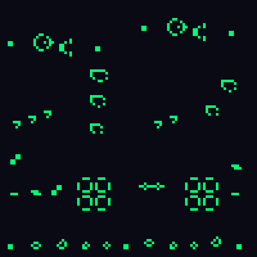

<h1 align="center">Lab 2 — Conway's Game of Life</h1>

<p align="center">
  <em>El Juego de la Vida de Conway renderizado en tiempo real sobre un framebuffer
  por software en Rust, con grilla toroidal y 15 organismos clásicos.</em>
</p>

<p align="center">
  
  
  
</p>

---

## Demo

<p align="center">
  
</p>

## Descripción

Cada célula es un píxel de un framebuffer pequeño de **100×100**. Un píxel verde
está **vivo**, uno oscuro está **muerto**. En cada frame se calcula una nueva
generación aplicando las reglas de Conway y el framebuffer se dibuja **escalado**
para llenar una ventana de 800×800 (bloques nítidos, nearest-neighbor).

El framebuffer **nunca se limpia**: la lógica del juego decide el estado de cada
célula, así que ella misma "borra" lo del frame anterior.

### Reglas (por turno)

| Situación | Vecinos vivos | Resultado |
| --------- | :-----------: | --------- |
| Célula viva | < 2 | muere (subpoblación) |
| Célula viva | 2 o 3 | sobrevive |
| Célula viva | > 3 | muere (sobrepoblación) |
| Célula muerta | exactamente 3 | nace (reproducción) |

### Orillas: grilla toroidal

Los bordes se envuelven: una célula del borde derecho es vecina de la del borde
izquierdo (y arriba/abajo igual). Índice de vecino = `(x + dx + W) % W`. Así las
naves y gliders nunca se pierden — cruzan la pantalla y reaparecen del otro lado.

## Organismos

Cada organismo es una función en [`patterns.rs`](src/patterns.rs) que coloca sus
células vivas en un offset dado. `seed()` reparte una mezcla por toda la grilla.

| Categoría | Organismos |
| --------- | ---------- |
| **Still lifes** | `block`, `beehive`, `loaf`, `boat`, `tub` |
| **Osciladores** | `blinker` (p2), `toad` (p2), `beacon` (p2), `pulsar` (p3), `pentadecathlon` (p15) |
| **Naves** | `glider`, `lwss`, `mwss`, `hwss` |
| **Cañones** | `gosper_gun` (un glider nuevo cada 30 generaciones) |

## Requisitos

- [Rust](https://www.rust-lang.org/tools/install) con `cargo` (toolchain con
  `edition = "2024"`, es decir Rust **1.85+**).
- Dependencias de sistema de raylib (compila desde fuente): un compilador de C,
  `cmake` y `git`.
  - Fedora: `sudo dnf install gcc cmake git`
  - Debian/Ubuntu: `sudo apt install build-essential cmake git`

## Cómo ejecutarlo

```bash
cargo run --release
```

> La primera compilación construye raylib y tarda unos minutos; las siguientes son
> casi instantáneas.

Se abre una ventana con la simulación a 12 generaciones por segundo. Cerrá la
ventana (o `Esc`) para salir.

## Cómo funciona

| Módulo | Responsabilidad |
| ------ | --------------- |
| [`framebuffer.rs`](src/framebuffer.rs) | Envuelve un `Image` de raylib. `set_pixel` / `get_color` (origen abajo-izquierda, invierte Y) y `swap_buffers`, que sube el buffer a una textura y la dibuja escalada a la ventana. |
| [`conway.rs`](src/conway.rs) | `step`: calcula la siguiente generación en un buffer aparte (hay que leer toda la generación actual antes de escribir), contando 8 vecinos con envoltura toroidal, y la escribe de vuelta. |
| [`patterns.rs`](src/patterns.rs) | Un organismo por función más `seed` para el estado inicial. |
| [`main.rs`](src/main.rs) | Abre la ventana, siembra el patrón y corre el bucle: dibujar → avanzar generación. |

## Parámetros

En [`main.rs`](src/main.rs): `GRID_W`, `GRID_H` (resolución de la simulación) y
`SCALE` (píxeles de ventana por célula). Probá `GRID_W = GRID_H = 300`, `SCALE = 3`
para una grilla más densa. La velocidad se ajusta con `set_target_fps`.

---

> Game of Life es Turing-completo: con estas reglas se puede construir cualquier
> cosa. Acá solo dejamos correr algunos organismos.
